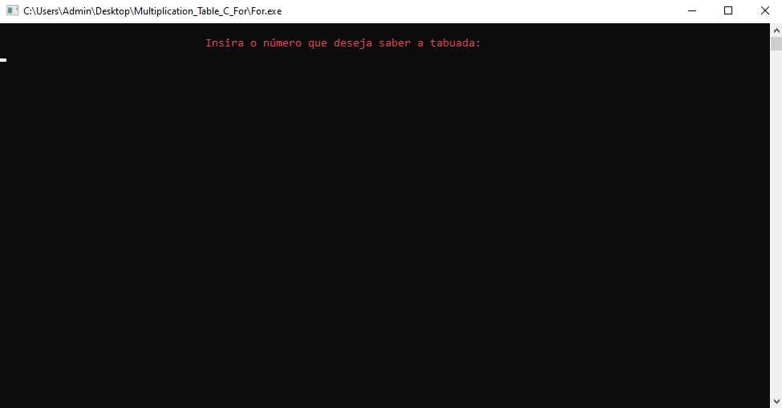
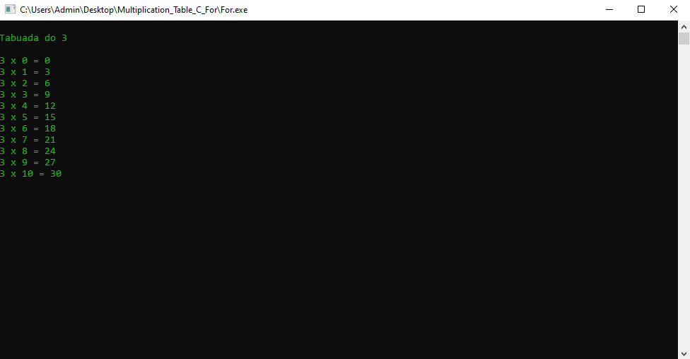
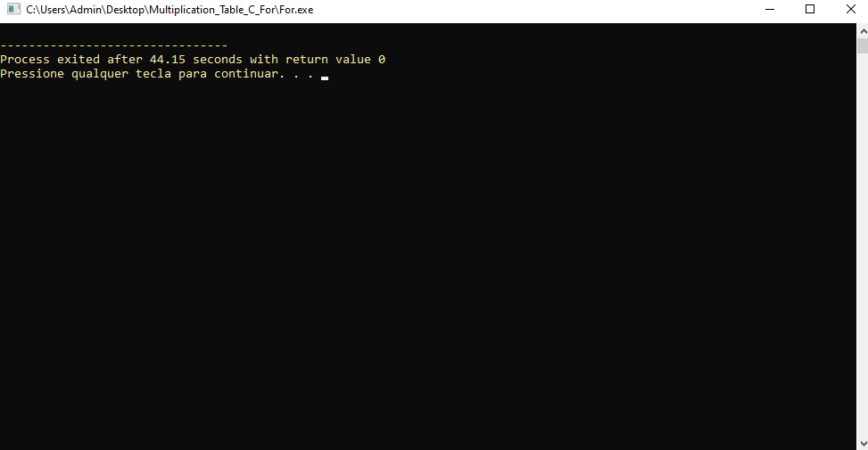

  

 

  <h1>TABUADA COM FOR 🧮</h1>

Este repositório em **C** calcula a tabuada de um número fornecido pelo usuário. O usuário insere um número, e o programa exibe a tabuada desse número de 0 a 10.

## 📸 Imagens do Projeto em Funcionamento

<table>
  <tr>
    <td align="center">
      
      
Tela inicial

    </td>
    <td align="center">
      
      
Inserção do número 3

    </td>
    <td align="center">
      
      
Resultado da tabuada do 3

    </td>
    <td align="center">
      
      
Fim da operação

    </td>
  </tr>
</table>